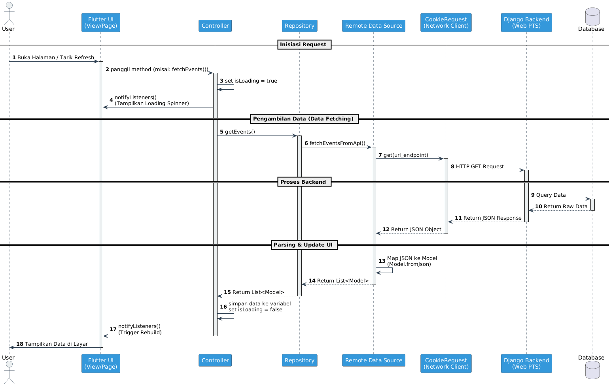

# Movezz Mobile (Flutter)


Repositori ini berisi **aplikasi mobile (Flutter)** untuk proyek **Movezz**, sebuah aplikasi sosial media untuk para pecinta olahraga yang terhubung dengan backend Django Movezz.

---

## Daftar Anggota Kelompok

> **Sama dengan backend Movezz (PBP):**

- Muhamad Hakim Nizami (2406399485)
- Nadin Ananda (2406351806)
- Heraldo Arman (2406420702)
- Roberto Eugenio Sugiarto (2406355640)
- Amberley Vidya Putri (2406495533)

---

## Deskripsi Proyek

**Movezz** adalah aplikasi sosial media yang ditujukan untuk pecinta olahraga: penggemar sepak bola, pelari, gym, hingga olahraga rekreasi lainnya. Pengguna dapat:

- Berbagi aktivitas olahraga di **feeds**,
- Menjelajah **profil** pengguna lain,
- Berkomunikasi via **messaging**,
- Mengikuti atau membuat **broadcast event** olahraga,
- Jual beli perlengkapan olahraga di **marketplace**.

Repositori ini berfokus pada **client Flutter** (Android, iOS, Web, Desktop) yang berkomunikasi dengan backend Django Movezz menggunakan **session-based auth (cookie)**.

---

## Modul / Fitur di Flutter

Struktur fitur di Flutter dibuat agar mirip dengan modularisasi di backend Django:

### 1. Feeds

PIC: Muhamad Hakim Nizami  
Folder: `lib/features/feeds`

Fitur:

- Menampilkan timeline aktivitas olahraga pengguna,
- Card posting (`post_card.dart`) dan komentar (`comment_bottom_sheet.dart`),
- Halaman feed utama (`feeds_page.dart` / `feed_page.dart`),
- Integrasi dengan endpoint feed backend.

### 2. Profile

PIC: Nadin Ananda  
Folder: `lib/features/profile`

Fitur:

- Halaman profil pengguna (`profile_page.dart`),
- Widget profil (`profile_widget.dart`),
- Integrasi untuk menampilkan postingan dan informasi pengguna (bio, olahraga favorit, dsb).

### 3. Messaging

PIC: Heraldo Arman  
Folder: `lib/features/messages`

Fitur:

- Halaman daftar pesan (`messages_page.dart`),
- Widget pesan (`messages_widget.dart`),
- Persiapan integrasi dengan modul chat/messaging backend.

### 4. Marketplace

PIC: Amberley Vidya Putri  
Folder: `lib/features/marketplace`

Fitur:

- Halaman marketplace (`marketplace_page.dart`),
- Widget listing marketplace (`marketplace_widget.dart`),
- Struktur data dan repository untuk listing barang olahraga.

### 5. Broadcast

PIC: Roberto Eugenio Sugiarto  
Folder: `lib/features/broadcast`

Fitur:

- Halaman broadcast/event (`broadcast_page.dart`),
- Widget event (`broadcast_widget.dart`),
- Integrasi dengan modul broadcast backend (event publik, siaran, dsb).

### 6. Authentication

PIC: all  
Folder: `lib/features/auth`

Fitur:

- Autentikasi menggunakan **session cookie** dari backend Django melalui `CookieRequest`.

---

## Alur Integrasi Data dengan Aplikasi Web PTS

Aplikasi Flutter ini berinteraksi penuh dengan aplikasi web (backend Django) yang telah dikembangkan pada Proyek Tengah Semester (PTS) melalui **Pacil Web Service**. Seluruh data yang ditampilkan di aplikasi mobile bersumber dari backend yang sama dengan yang digunakan oleh aplikasi web, sehingga memastikan konsistensi data di kedua platform.


Diagram berikut menunjukkan alur integrasi data secara visual:




Alur integrasi datanya adalah sebagai berikut:

1.  **Aksi Pengguna di Aplikasi Flutter**: Pengguna melakukan aksi seperti login, melihat _feeds_, atau memposting konten baru melalui antarmuka aplikasi Flutter.

2.  **Pemanggilan _Controller_ dan _Repository_**: Aksi pengguna memicu pemanggilan fungsi di dalam _Controller_ (misalnya, `FeedsController`). _Controller_ kemudian memanggil _Repository_ yang bertugas sebagai perantara antara layer data dan layer presentasi.

3.  **Permintaan HTTP oleh _DataSource_**: _Repository_ memanggil _Remote DataSource_, yang bertanggung jawab untuk membuat permintaan HTTP ke backend Django. Permintaan ini menggunakan library `pbp_django_auth` (`CookieRequest`) untuk berkomunikasi dengan API.

4.  **Akses Endpoint API di Backend Django**: Backend Django menerima permintaan pada _endpoint_ yang sesuai (misalnya, `GET /feeds/api/posts/`). _View_ di Django akan memproses permintaan tersebut, berinteraksi dengan _model_ dan database jika diperlukan.

5.  **Serialisasi Data ke JSON**: Setelah data didapatkan dari database, Django (menggunakan Django REST Framework) akan melakukan serialisasi data dari objek Python (QuerySet) menjadi format **JSON**.

6.  **Pengiriman Respons JSON**: Backend mengirimkan respons HTTP yang berisi data dalam format JSON kembali ke aplikasi Flutter.

7.  **Deserialisasi dan Pembaruan State**: Aplikasi Flutter menerima respons JSON. _DataSource_ atau _Repository_ akan melakukan deserialisasi (parsing) dari JSON menjadi objek Dart (_model_). Data ini kemudian digunakan oleh _Controller_ untuk memperbarui _state_ aplikasi (misalnya, daftar postingan di _feeds_).

8.  **Pembaruan Antarmuka (UI)**: Berkat _state management_ (Provider), perubahan pada _state_ akan secara otomatis memperbarui antarmuka pengguna, sehingga data terbaru dari backend akan ditampilkan kepada pengguna.

Dengan alur ini, aplikasi Flutter berfungsi sebagai _client_ yang menampilkan dan mengelola data, sementara semua logika bisnis, validasi, dan interaksi dengan database ditangani oleh backend Django yang sama dengan yang digunakan oleh PWS.

---

## Arsitektur Proyek Flutter

Struktur folder utama (disederhanakan):

```text
lib/
  core/
    config/
      app_config.dart     # Konfigurasi statis aplikasi (nama, versi, page size, dll.)
      env.dart            # Konfigurasi base URL backend (BACKEND_BASE_URL)
    routing/
      app_router.dart     # Definisi route & onGenerateRoute
    theme/
      app_theme.dart      # Tema global (light/dark)
    utils/
      extensions.dart     # Extension helper (String, BuildContext, DateTime, dll.)
    widgets/
      app_button.dart     # Button standar aplikasi
      app_text_field.dart # TextField standar aplikasi

  features/
    auth/
      data/
        datasources/
        models/
        repositories/
      presentation/
        controllers/
        pages/
        widgets/
    feeds/
    profile/
    broadcast/
    marketplace/
    messages/

  shared/
    models/
      lorem_model.dart    # Contoh model shared

  main.dart               # Entry point Flutter (MaterialApp + routing + provider)
```

**Pola umum per fitur:**

- `data/models` → representasi JSON dari backend (DTO / model),
- `data/datasources` → call HTTP ke backend (via `CookieRequest`),
- `data/repositories` → abstraksi data untuk layer UI,
- `presentation/controllers` → state management (ChangeNotifier, dsb.),
- `presentation/pages` → screen / halaman,
- `presentation/widgets` → komponen UI kecil.

---

## Environment & Konfigurasi Backend URL

Di root proyek terdapat:

- `.env` – konfigurasi environment lokal (untuk tim),
- `.env.example` – contoh template variabel environment.

Pada sisi Flutter, base URL backend dibaca melalui **`Env.backendBaseUrl`**:

```dart
// lib/core/config/env.dart
static const String backendBaseUrl = String.fromEnvironment(
  'BACKEND_BASE_URL',
  defaultValue: 'http://10.0.2.2:8000',
);
```

Artinya:

- Default mengarah ke `http://10.0.2.2:8000` (akses localhost dari Android emulator),
- Bisa dioverride dengan `--dart-define`.

### Contoh isi `.env.example`

```env
BACKEND_BASE_URL=http://10.0.2.2:8000
```

Developer bisa menyalin:

```bash
cp .env.example .env
# lalu edit BACKEND_BASE_URL sesuai environment masing-masing
```

---

## Autentikasi: CookieRequest + Django Session

File: `lib/core/network/cookie_request.dart`

Aplikasi ini menggunakan library `CookieRequest` (adaptasi dari `pbp_django_auth`) untuk:

- Login/logout ke endpoint Django,
- Menyimpan cookie `sessionid` di `SharedPreferences`,
- Mengirim header `Cookie` pada request berikutnya,
- Menentukan status `loggedIn` dan menyimpan `jsonData` terakhir.

Cara pakai di data source:

```dart
import 'package:movezz_mobile/core/config/env.dart';
import 'package:movezz_mobile/core/network/cookie_request.dart';

class AuthRemoteDataSource {
  final CookieRequest cookieRequest;

  AuthRemoteDataSource(this.cookieRequest);

  Future<Map<String, dynamic>> login(String username, String password) async {
    final url = Env.api('/auth/login-flutter/');
    return await cookieRequest.login(url, {
      'username': username,
      'password': password,
    });
  }
}
```

---

## Cara Menjalankan (Development)

### 1. Clone Repository

```bash
git clone https://github.com/E1PBP/movezz_mobile.git
cd movezz_mobile
```

### 2. Pastikan Backend Django Berjalan

Jalankan backend Movezz (repositori Django):

```bash
git clone https://github.com/E1PBP/movezz.git
cd movezz
# setup virtualenv, install requirements, migrate, lalu:
python manage.py runserver
```

Secara default backend akan berjalan di `http://127.0.0.1:8000/`.

### 3. Setup Environment

Salin contoh `.env`:

```bash
cp .env.example .env
# lalu edit nilai BACKEND_BASE_URL jika perlu
```

Contoh untuk emulator Android:

```env
BACKEND_BASE_URL=http://10.0.2.2:8000
```

### 4. Install Dependency Flutter

```bash
flutter pub get
```

### 5. Jalankan Aplikasi

#### Android (emulator/device)

```bash
flutter run \
  --dart-define=BACKEND_BASE_URL=http://10.0.2.2:8000
```

#### Web (Chrome)

```bash
flutter run -d chrome \
  --dart-define=BACKEND_BASE_URL=http://localhost:8000
```

> Sesuaikan URL dengan alamat backend Django kamu.

---

## Tech Stack

- **Frontend:**

  - [Flutter](https://flutter.dev/)
  - [Dart](https://dart.dev/)

- **Backend (terpisah):**

  - [Django 5](https://www.djangoproject.com/)
  - PostgreSQL
  - Cloudinary (media storage)

- **Tools:**
  - Provider (state management dasar)
  - SharedPreferences (persistent storage sederhana)
  - http
  - goRoutes
  - pbp_django_auth

---

## Link Terkait


- **Repository Backend Django:**  
  [https://github.com/E1PBP/movezz](https://github.com/E1PBP/movezz)

- **PWS (Deployment Backend):**  
  [https://muhamad-hakim41-movezz.pbp.cs.ui.ac.id/](https://muhamad-hakim41-movezz.pbp.cs.ui.ac.id/)

- **Figma Design:**  
  [https://www.figma.com/design/x4q0GDfJB0dQ2ZXl8uuXDZ/Design-Movezz](https://www.figma.com/design/x4q0GDfJB0dQ2ZXl8uuXDZ/Design-Movezz)

- **DB Diagram:**  
  [https://dbdiagram.io/d/movezz-2-68e696cad2b621e422e8abc6](https://dbdiagram.io/d/movezz-2-68e696cad2b621e422e8abc6)

- **Tautan APK:**  
  [https://app.bitrise.io/app/9316a6d8-cdaa-4e14-a516-a8bef99bd3a1/installable-artifacts/1e745be503eefd1a/public-install-page/fb077fe6a01e060a4cff23da102cb5dc](https://app.bitrise.io/app/9316a6d8-cdaa-4e14-a516-a8bef99bd3a1/installable-artifacts/1e745be503eefd1a/public-install-page/fb077fe6a01e060a4cff23da102cb5dc)

- **Tautan SlidesDeck:**  
  [https://www.canva.com/design/DAG8IEoBBuU/nSQTk7X6RqDyRcZvv83GVQ/edit?utm_content=DAG8IEoBBuU&utm_campaign=designshare&utm_medium=link2&utm_source=sharebutton](https://www.canva.com/design/DAG8IEoBBuU/nSQTk7X6RqDyRcZvv83GVQ/edit?utm_content=DAG8IEoBBuU&utm_campaign=designshare&utm_medium=link2&utm_source=sharebutton)

- **Tautan Video:**  
  [https://youtu.be/X3Xf6GiEsYc?si=2cubzyjOpC_gYUsa](https://youtu.be/X3Xf6GiEsYc?si=2cubzyjOpC_gYUsa)

---
